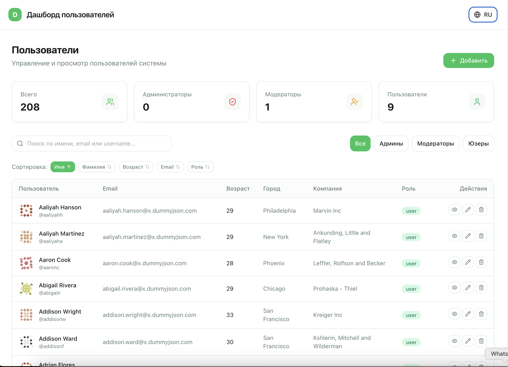

## Процесс разработки

- **Время выполнения ТЗ** — полный функционал от первой строки кода до рабочего демо реализован за **1 час**.
- **AI + Human-in-the-loop** — вся разработка велась при помощи ИИ-агентов (кодогенерация, рефакторинг, отладка) под контролем опытного разработчика с полным **code review** и функциональным тестированием каждого модуля.
- **Демонстрация технических возможностей** — в проекте намеренно использован широкий стек технологий (TanStack Query, Zod, react-hook-form, i18next, sonner, Tailwind, Feature-Sliced Design) для демонстрации компетенций в работе с современными библиотеками, архитектурными паттернами и интеграцией сторонних API.

# Дашборд пользователей

Фронтенд-приложение — полноценный дашборд для управления пользователями на основе публичного API [dummyjson.com/users](https://dummyjson.com/users). Поддерживаются все CRUD-операции, пагинация, сортировка, поиск, фильтрация, toast-уведомления и двуязычный интерфейс (RU/EN).

## Запуск

```bash
npm install
npm run dev
```

Приложение разворачивается на порту **5175** (указано в `vite.config.ts`).

## Функционал

- **Полный CRUD**
  - **Create** — добавление нового пользователя через модальную форму с валидацией.
  - **Read** — список пользователей в таблице с аватарами и бейджами ролей, детальный просмотр в модалке.
  - **Update** — редактирование любого пользователя.
  - **Delete** — удаление с подтверждением.
- **Пагинация** — переключение страниц и выбор лимита (5 / 10 / 20 / 30).
- **Серверный поиск** — debounced-поиск по имени, email, username (`/users/search?q=`).
- **Фильтрация по роли** — серверная фильтрация через `/users/filter?key=role&value=`.
- **Сортировка** — по имени, фамилии, возрасту, email, роли (asc/desc).
- **Toast-нотификации** — `sonner` с уведомлениями об успехе и ошибках всех операций.
- **Локализация (i18n)** — полный перевод интерфейса на русский и английский. По умолчанию русский. Переключатель в шапке.
- **Адаптивность** — таблица с горизонтальным скроллом на мобильных устройствах.

## Скриншот │

 <p align="center"> │
  │
</p>

## Архитектура и решения

### 1. За основу взят существующий стек

Проект унаследовал конфигурацию из `/Users/ivantereshchencko/Desktop/almaty camping/frontend`:

- **Vite** — быстрый HMR и сборка.
- **React 18 + TypeScript** — типобезопасность и современный UI.
- **Tailwind CSS** — утилитарные стили, адаптивность, тёмная тема через CSS-переменные.
- **TanStack Query** — кеширование, инвалидация после мутаций, статусы загрузки/ошибок.
- **Axios** — HTTP-клиент.
- **Lucide React** — иконки.

### 2. Добавленные библиотеки

- **sonner** — лёгкие и красивые toast-уведомления без лишних зависимостей.
- **react-hook-form + @hookform/resolvers + zod** — управление формами и валидация полей.
- **i18next + react-i18next + i18next-browser-languagedetector** — полноценная локализация с автоопределением языка браузера, fallback на русский и сохранением выбора в `localStorage`.

### 3. Структура проекта (FSD-стиль)

- `src/app/` — точка входа, провайдеры (QueryClient + Router + Toaster), инициализация i18n, стили.
- `src/pages/dashboard/` — страница дашборда с логикой фильтров, пагинации и мутаций.
- `src/widgets/` — крупные блоки: шапка с переключателем языка, список пользователей, модальное окно деталей.
- `src/features/` — фичи: форма создания/редактирования, подтверждение удаления.
- `src/entities/user/` — типы, Zod-схема валидации и API (CRUD + пагинация + поиск).
- `src/shared/` — утилиты (`cn`, `query-client`, `use-debounce`, `i18n`), конфиг роутов, JSON-переводы.

### 4. Public API через index.ts

Каждый слой и сегмент экспортирует только публичный интерфейс через `index.ts`, что позволяет импортировать всё через короткие пути:

```ts
import { UserList, Header } from "@/widgets";
import { UserFormModal } from "@/features";
import type { User, UserFormValues } from "@/entities";
import { ROUTES, useDebounce } from "@/shared";
```

### 5. Работа с API

Используется TanStack Query:

- `useQuery` с динамическим `queryKey` для серверного поиска, фильтра, сортировки и пагинации.
- `useMutation` для Create / Update / Delete с последующей инвалидацией `['users']`.
- `staleTime: 5 мин` и `refetchOnWindowFocus: false` чтобы снизить нагрузку.

API dummyjson.com **симулирует** записывающие операции (POST/PUT/DELETE), поэтому после перезагрузки страницы изменения исчезают. В UI это отражено текстом «(симуляция)» в toast-уведомлениях.

### 6. UX/UI

- **Переключатель языка** в шапке — переключает RU/EN и сохраняет выбор.
- **Статистика сверху** — быстрая сводка по ролям на текущей странице.
- **Debounce поиска** — 400 мс задержки перед отправкой запроса, чтобы не спамить API.
- **Обработка состояний** — скелетон/спиннер загрузки, сообщения об ошибках, пустые состояния.
- **Порт 5175** зафиксирован в `vite.config.ts` (`strictPort: true`).

# Дашборд пользователей

Фронтенд-приложение — полноценный дашборд для управления пользователями на основе публичного API [dummyjson.com/users](https://dummyjson.com/users). Поддерживаются все CRUD-операции, пагинация, сортировка, поиск, фильтрация, toast-уведомления и двуязычный интерфейс (RU/EN).

## Запуск

```bash
npm install
npm run dev
```

Приложение разворачивается на порту **5175** (указано в `vite.config.ts`).

## Функционал

- **Полный CRUD**
  - **Create** — добавление нового пользователя через модальную форму с валидацией.
  - **Read** — список пользователей в таблице с аватарами и бейджами ролей, детальный просмотр в модалке.
  - **Update** — редактирование любого пользователя.
  - **Delete** — удаление с подтверждением.
- **Пагинация** — переключение страниц и выбор лимита (5 / 10 / 20 / 30).
- **Серверный поиск** — debounced-поиск по имени, email, username (`/users/search?q=`).
- **Фильтрация по роли** — серверная фильтрация через `/users/filter?key=role&value=`.
- **Сортировка** — по имени, фамилии, возрасту, email, роли (asc/desc).
- **Toast-нотификации** — `sonner` с уведомлениями об успехе и ошибках всех операций.
- **Локализация (i18n)** — полный перевод интерфейса на русский и английский. По умолчанию русский. Переключатель в шапке.
- **Адаптивность** — таблица с горизонтальным скроллом на мобильных устройствах.

## Архитектура и решения

### 1. За основу взят существующий стек

Проект унаследовал конфигурацию из `/Users/ivantereshchencko/Desktop/almaty camping/frontend`:

- **Vite** — быстрый HMR и сборка.
- **React 18 + TypeScript** — типобезопасность и современный UI.
- **Tailwind CSS** — утилитарные стили, адаптивность, тёмная тема через CSS-переменные.
- **TanStack Query** — кеширование, инвалидация после мутаций, статусы загрузки/ошибок.
- **Axios** — HTTP-клиент.
- **Lucide React** — иконки.

### 2. Добавленные библиотеки

- **sonner** — лёгкие и красивые toast-уведомления без лишних зависимостей.
- **react-hook-form + @hookform/resolvers + zod** — управление формами и валидация полей.
- **i18next + react-i18next + i18next-browser-languagedetector** — полноценная локализация с автоопределением языка браузера, fallback на русский и сохранением выбора в `localStorage`.

### 3. Структура проекта (FSD-стиль)

- `src/app/` — точка входа, провайдеры (QueryClient + Router + Toaster), инициализация i18n, стили.
- `src/pages/dashboard/` — страница дашборда с логикой фильтров, пагинации и мутаций.
- `src/widgets/` — крупные блоки: шапка с переключателем языка, список пользователей, модальное окно деталей.
- `src/features/` — фичи: форма создания/редактирования, подтверждение удаления.
- `src/entities/user/` — типы, Zod-схема валидации и API (CRUD + пагинация + поиск).
- `src/shared/` — утилиты (`cn`, `query-client`, `use-debounce`, `i18n`), конфиг роутов, JSON-переводы.

### 4. Public API через index.ts

Каждый слой и сегмент экспортирует только публичный интерфейс через `index.ts`, что позволяет импортировать всё через короткие пути:

```ts
import { UserList, Header } from "@/widgets";
import { UserFormModal } from "@/features";
import type { User, UserFormValues } from "@/entities";
import { ROUTES, useDebounce } from "@/shared";
```

### 5. Работа с API

Используется TanStack Query:

- `useQuery` с динамическим `queryKey` для серверного поиска, фильтра, сортировки и пагинации.
- `useMutation` для Create / Update / Delete с последующей инвалидацией `['users']`.
- `staleTime: 5 мин` и `refetchOnWindowFocus: false` чтобы снизить нагрузку.

API dummyjson.com **симулирует** записывающие операции (POST/PUT/DELETE), поэтому после перезагрузки страницы изменения исчезают. В UI это отражено текстом «(симуляция)» в toast-уведомлениях.

### 6. UX/UI

- **Переключатель языка** в шапке — переключает RU/EN и сохраняет выбор.
- **Статистика сверху** — быстрая сводка по ролям на текущей странице.
- **Debounce поиска** — 400 мс задержки перед отправкой запроса, чтобы не спамить API.
- **Обработка состояний** — скелетон/спиннер загрузки, сообщения об ошибках, пустые состояния.
- **Порт 5175** зафиксирован в `vite.config.ts` (`strictPort: true`).
